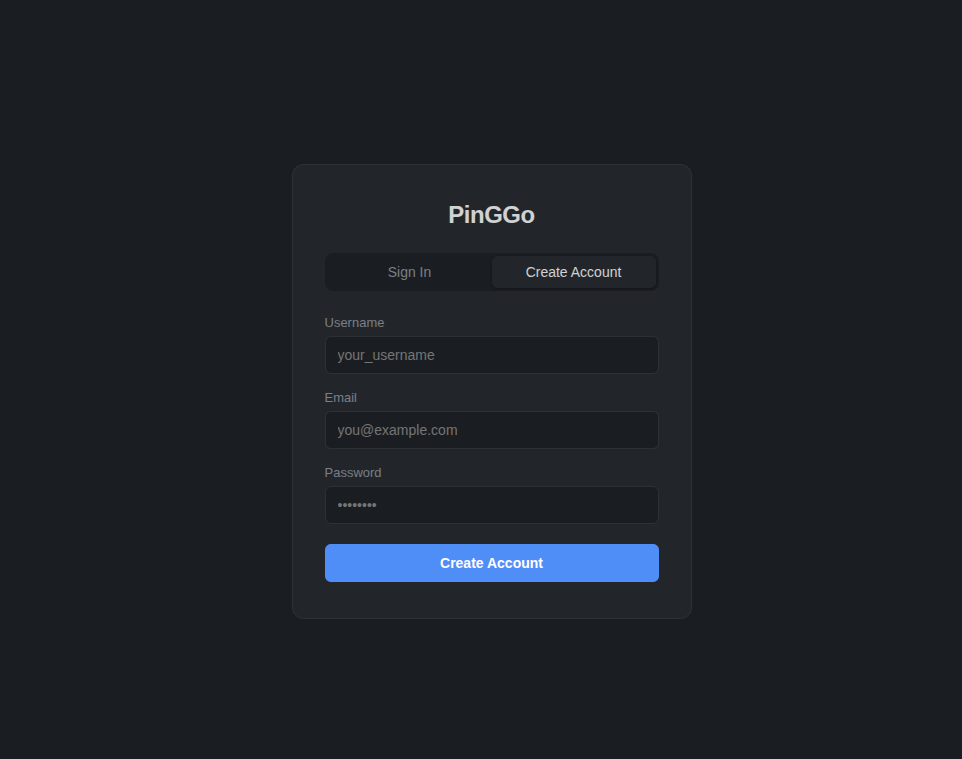
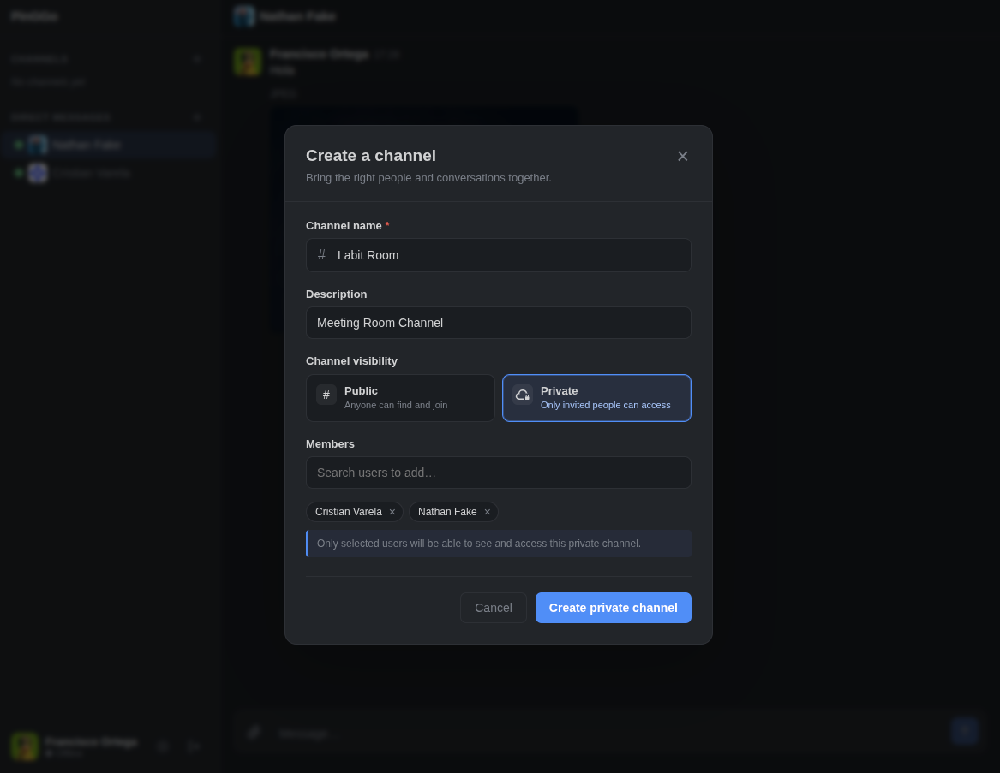
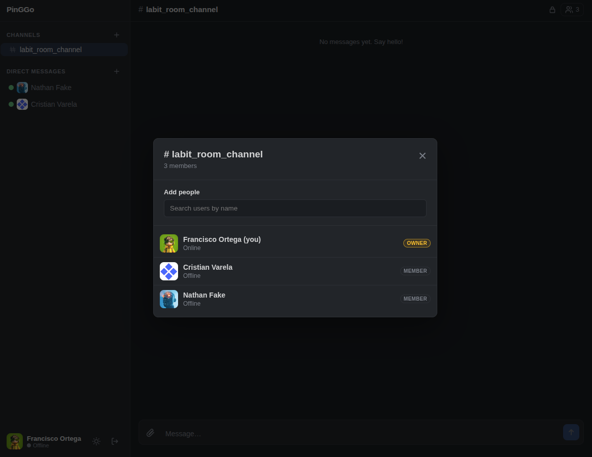
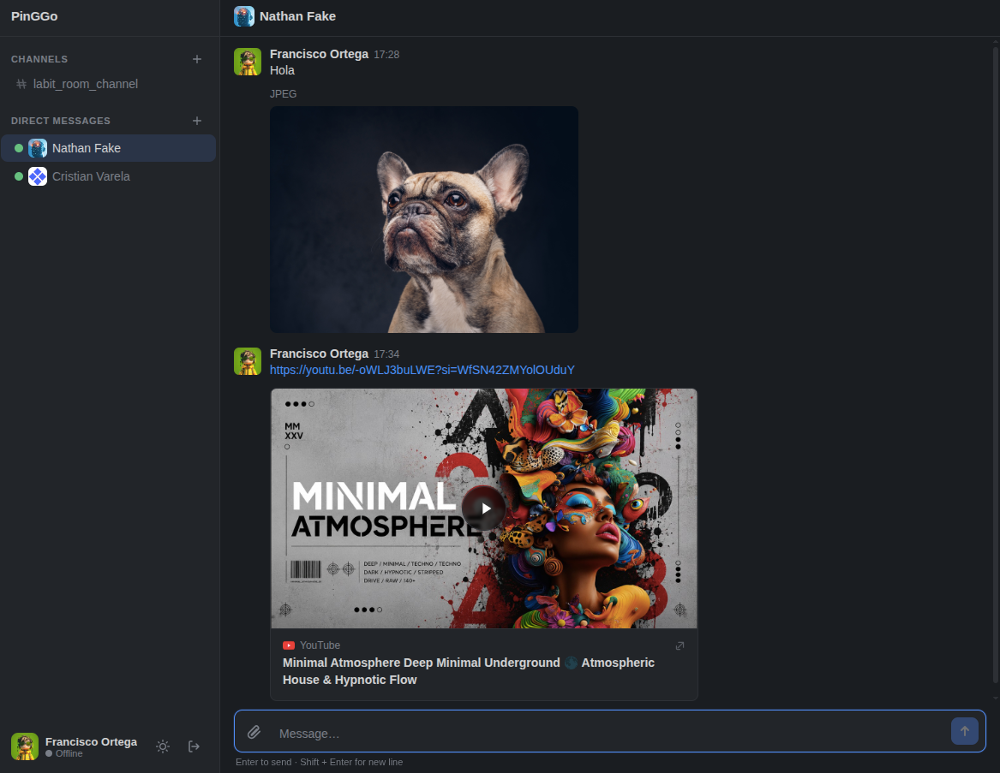

<div align="center">

# 🚀 PinGGo

### Real-Time Messaging Platform for Modern Teams

[](https://nodejs.org/)
[](https://kit.svelte.dev/)
[](https://socket.io/)
[](https://www.mysql.com/)
[](https://redis.io/)
[](https://aws.amazon.com/s3/)

*Deep integration with Skylab platform — A messaging experience purpose-built for internal team communication*

[Features](#-features) • [Demo](#-screenshots) • [Tech Stack](#-tech-stack) • [Getting Started](#-getting-started) • [Architecture](#-architecture)

</div>

---

## Screenshots

<div align="center">

### Login Experience


*Secure authentication with JWT tokens and httpOnly cookies*

<br/>

### Create & Manage Channels


*Public and private channels for organized team communication*

<br/>

### Team Collaboration


*Manage channel members with real-time presence indicators*

<br/>

### Real-Time Chat & File Sharing


*Instant messaging with file uploads, link previews, and rich media support*

</div>

---

## Features

### 💬 **Real-Time Communication**
- **WebSocket-powered messaging** with Socket.IO for instant delivery
- **Typing indicators** and read receipts
- **Presence system** (Online, Away, DND, Offline)
- **Message reactions**, editing, and deletion
- **@mentions** and notifications

### 📁 **File Management**
- Secure file uploads via **AWS S3** with presigned URLs
- **Image thumbnails** and previews
- **Document handling** (PDF, Office files)
- **Link preview generation** for shared URLs
- **Drag & drop** file upload support

### 👥 **Channels & Direct Messages**
- **Public and private channels**
- **Direct messaging** and group conversations
- **Channel member management**
- **Unread message counters**
- **Real-time user search**

### 🔐 **Security First**
- **JWT authentication** with httpOnly refresh tokens
- **Rate limiting** and helmet protection
- **Self-hosted infrastructure** — your data stays with you
- **bcrypt password hashing**
- **CORS protection** and secure cookie handling

### 🎨 **Modern UI/UX**
- **Dark-themed command center** aesthetic
- **Responsive design** for all devices
- **Emoji picker** and rich text formatting
- **Smooth animations** and transitions
- **System font stack** for optimal readability

---

## Tech Stack

### **Frontend**
- **[SvelteKit](https://kit.svelte.dev/)** 5.x - Modern full-stack framework
- **[Socket.IO Client](https://socket.io/)** 4.7 - Real-time bidirectional communication
- **[PDF.js](https://mozilla.github.io/pdf.js/)** - PDF rendering
- **Svelte Stores** - Reactive state management
- **Vite** - Lightning-fast build tool

### **Backend**
- **[Node.js](https://nodejs.org/)** + **[Express](https://expressjs.com/)** - API server
- **[Socket.IO](https://socket.io/)** 4.7 - WebSocket server with Redis adapter
- **[MySQL](https://www.mysql.com/)** 8.0 - Primary relational database
- **[Redis](https://redis.io/)** - Session management & pub/sub messaging
- **[AWS S3](https://aws.amazon.com/s3/)** - Scalable file storage
- **[JWT](https://jwt.io/)** - Stateless authentication
- **bcryptjs** - Secure password hashing
- **Multer** - File upload middleware

### **DevOps & Infrastructure**
- **[Docker](https://www.docker.com/)** + **Docker Compose** - Containerization
- **Nodemon** - Development hot-reload
- **Helmet** - Security headers
- **express-rate-limit** - API rate limiting

---

## 🚀 Getting Started

### Prerequisites

- **Node.js** 18+ 
- **Docker** & **Docker Compose**
- **AWS Account** (for S3 bucket)

### Installation

1. **Clone the repository**
   ```bash
   git clone https://github.com/franOrteg/pinGGo.git
   cd pinGGo
   ```

2. **Configure environment variables**
   
   Create `.env` files in both `back/` and `front/` directories:

   **`back/.env`**
   ```env
   # Server
   PORT=3000
   NODE_ENV=development
   
   # Database
   DB_HOST=mysql
   DB_PORT=3306
   DB_USER=pinggo
   DB_PASSWORD=your_password
   DB_NAME=pinggo
   
   # Redis
   REDIS_HOST=redis
   REDIS_PORT=6379
   
   # JWT
   JWT_SECRET=your_secret_key
   JWT_REFRESH_SECRET=your_refresh_secret
   
   # AWS S3
   AWS_REGION=us-east-1
   AWS_ACCESS_KEY_ID=your_access_key
   AWS_SECRET_ACCESS_KEY=your_secret_key
   S3_BUCKET=your-bucket-name
   
   # CORS
   CLIENT_URL=http://localhost:5173
   ```

   **`front/.env`**
   ```env
   PUBLIC_API_URL=http://localhost:3000
   PUBLIC_WS_URL=http://localhost:3000
   ```

3. **Start with Docker Compose**
   ```bash
   docker-compose up -d
   ```

4. **Initialize the database**
   ```bash
   docker-compose exec back npm run db:migrate
   ```

5. **Access the application**
   - Frontend: [http://localhost:5173](http://localhost:5173)
   - Backend API: [http://localhost:3000](http://localhost:3000)

### Development Mode

**Backend:**
```bash
cd back
npm install
npm run dev
```

**Frontend:**
```bash
cd front
npm install
npm run dev
```

---

## Architecture

```
pinGGo/
├── back/                    # Backend API & WebSocket server
│   ├── src/
│   │   ├── api/            # REST endpoints
│   │   │   ├── auth/       # Authentication routes
│   │   │   ├── channels/   # Channel management
│   │   │   ├── messages/   # Message operations
│   │   │   ├── upload/     # File upload handling
│   │   │   └── users/      # User management
│   │   ├── socket/         # Socket.IO handlers
│   │   │   ├── handlers/   # Message & presence handlers
│   │   │   └── middleware/ # Socket authentication
│   │   ├── services/       # Business logic layer
│   │   ├── middleware/     # Auth, error handling
│   │   ├── db/            # MySQL connection & schema
│   │   ├── redis/         # Redis client & pub/sub
│   │   └── config/        # Configuration management
│   └── Dockerfile
│
├── front/                   # SvelteKit frontend
│   ├── src/
│   │   ├── routes/         # SvelteKit pages
│   │   │   ├── login/      # Login page
│   │   │   └── chat/       # Chat interface
│   │   ├── lib/
│   │   │   ├── components/ # Svelte components
│   │   │   │   ├── ChannelView.svelte
│   │   │   │   ├── MessageList.svelte
│   │   │   │   ├── MessageInput.svelte
│   │   │   │   ├── Sidebar.svelte
│   │   │   │   └── ...
│   │   │   ├── stores/     # State management
│   │   │   │   ├── auth.js
│   │   │   │   ├── channels.js
│   │   │   │   ├── messages.js
│   │   │   │   └── presence.js
│   │   │   ├── socket/     # Socket.IO client
│   │   │   └── api/        # API client
│   │   └── app.css
│   └── Dockerfile
│
├── docker-compose.yml       # Multi-container orchestration
├── DESIGN.md               # Design system documentation
└── PRODUCT.md              # Product specification
```

### Key Design Patterns

- **Service Layer Architecture** - Business logic separated from routing
- **Socket.IO Rooms** - Efficient channel-based message broadcasting
- **Redis Adapter** - Horizontal scaling support for Socket.IO
- **Presigned S3 URLs** - Secure, direct file uploads without proxy
- **JWT + Refresh Tokens** - Stateless authentication with rotation
- **Reactive Stores** - Svelte stores for real-time UI updates

---

## 🔧 API Endpoints

### Authentication
- `POST /api/auth/register` - User registration
- `POST /api/auth/login` - User login
- `POST /api/auth/refresh` - Refresh access token
- `POST /api/auth/logout` - User logout

### Channels
- `GET /api/channels` - List user channels
- `POST /api/channels` - Create channel
- `POST /api/channels/:id/join` - Join channel
- `GET /api/channels/:id/members` - List members
- `DELETE /api/channels/:id/members/:userId` - Remove member

### Messages
- `GET /api/messages/:channelId` - Get channel messages (paginated)
- `POST /api/messages` - Send message (also via Socket.IO)
- `PUT /api/messages/:id` - Edit message
- `DELETE /api/messages/:id` - Delete message

### Users
- `GET /api/users/search` - Search users
- `GET /api/users/me` - Get current user profile

### Files
- `POST /api/upload` - Get S3 presigned URL for upload
- `GET /api/download/:key` - Get download URL
- `GET /api/thumbnails/:messageId` - Get image thumbnail
- `GET /api/previews/:messageId` - Get link preview data

---

## WebSocket Events

### Client → Server
- `message:send` - Send new message
- `message:edit` - Edit message
- `message:delete` - Delete message
- `typing:start` - User started typing
- `typing:stop` - User stopped typing
- `presence:update` - Update user presence status

### Server → Client
- `message:new` - New message received
- `message:updated` - Message edited
- `message:deleted` - Message deleted
- `typing:user` - User is typing notification
- `presence:change` - User presence changed
- `unread:update` - Unread count updated

---

## Design System

PinGGo follows a **"Command Center"** design philosophy — a calm, dark interface that recedes into the background so conversations take center stage.

### Color Palette

| Purpose | Color | Hex |
|---------|-------|-----|
| **Carbon Background** | Deep layer | `#1a1d21` |
| **Surface** | Elevated containers | `#222529` |
| **Border** | Dividers | `#2d3035` |
| **Text Primary** | Main content | `#d1d2d3` |
| **Text Muted** | Secondary labels | `#7a7f88` |
| **Accent Blue** | Interactive elements | `#4f8ef7` |
| **Online** | Active users | `#3abf7e` |
| **Away** | Idle status | `#e0b94a` |
| **DND** | Do not disturb | `#e05a4e` |

### Key Principles

1. **Integrated, not isolated** — Conversations connect to Skylab's data and workflows
2. **Simple by default** — Essential messaging without overwhelming feature bloat
3. **Real-time first** — Instant delivery, presence, and typing feedback
4. **Self-hosted control** — Data stays within the organization's infrastructure

See [DESIGN.md](DESIGN.md) for the complete design system specification.

---

## Security Features

- **JWT Authentication** with access and refresh token rotation
- **httpOnly Cookies** for refresh token storage (XSS protection)
- **bcrypt Password Hashing** with salt rounds
- **Rate Limiting** on authentication endpoints
- **Helmet.js** for security headers
- **CORS Configuration** with whitelist
- **Input Validation** and sanitization
- **SQL Injection Protection** via parameterized queries
- **Presigned S3 URLs** for secure file access

---

## Database Schema

```sql
-- Users table
users (
  id, username, email, password_hash,
  display_name, avatar_url, status,
  created_at, updated_at
)

-- Channels table
channels (
  id, name, description, is_private,
  created_by, created_at
)

-- Channel members
channel_members (
  channel_id, user_id, role,
  joined_at, last_read_at
)

-- Messages
messages (
  id, channel_id, user_id, content,
  file_key, file_name, file_size, file_type,
  edited_at, created_at
)

-- Message reactions
message_reactions (
  message_id, user_id, emoji, created_at
)
```

## 🤝 Contributing

Contributions are welcome! Please follow these steps:

1. Fork the repository
2. Create a feature branch (`git checkout -b feature/AmazingFeature`)
3. Commit your changes (`git commit -m 'Add some AmazingFeature'`)
4. Push to the branch (`git push origin feature/AmazingFeature`)
5. Open a Pull Request

---

## License

This project is part of the **Skylab ecosystem** and is intended for internal organizational use.

---

## Acknowledgments

- Built with ❤️ for modern team collaboration
- Inspired by Slack, Discord, and modern chat platforms
- Designed for deep integration with the Skylab ecosystem
- Powered by the incredible open-source community

---

<div align="center">

**[⬆ Back to Top](#-pinggo)**

Made with ☕ and Svelte | PinGGo © 2026

</div>
